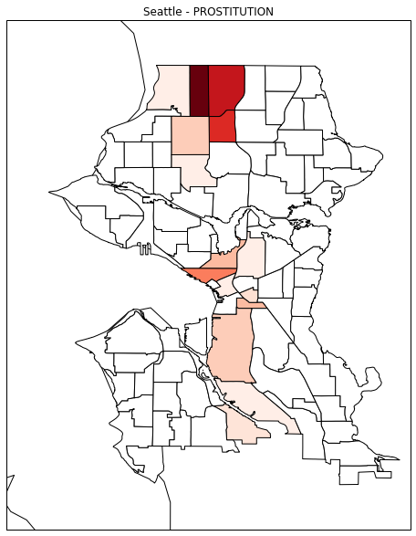
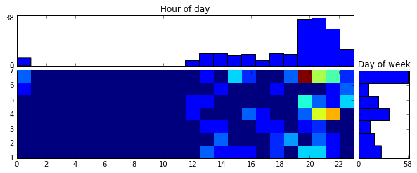
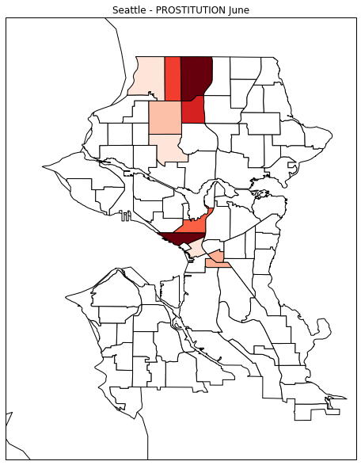
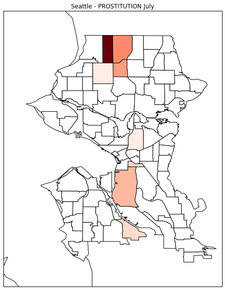
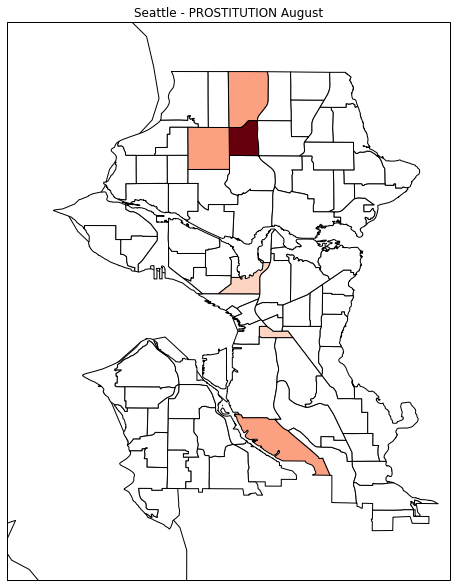
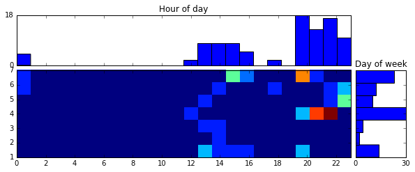
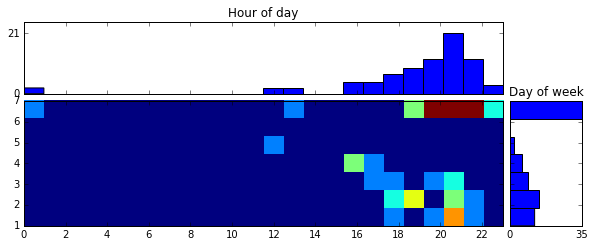
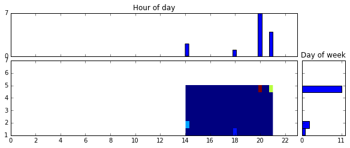

#Prostitution in Seattle most common in North District, on Sunday (7PM-9PM) and on Thursday (8PM-10PM) during 2014 summer months

>This report is an assignment of one of coursera course about big data. To put it in a shell this notebook is a practical analysis and visualization of Seattle incidents happened during summer 2014 data and this report highlight one statement. 
>This report is based on raw materials contained in [this notebook](../Seattle crime activity during summer 2014.ipynb).

##Localization

Let's picture prostitution locations on Seattle neighborhoods.

The Choropleth map shows two peaks:
- one located in the north neighborhoods (it includes the 3 most active neighborhoods)
- one located in the center (less intense and more diffuse)

As stated, most prostitution occurred in the north.

##Day and time

Now let's have a look at prostitution activity through the week (from MONDAY 0 o'clock to SUNDAY 24 o'clock).

This figure contains 3 histograms :
- One for days of week
- One for hours of day
- One containing both information (2d histogram)

From this figure we can see that:
- From an hours of day perspective prostitution occurred:
	+ mostly between 7PM to 22PM
	+ there is a latent activity starting at 12AM up to 7PM
	+ nothing happened during the morning (1AM to 12PM)
- From a days of week perspective most activities happened on Sunday
- From both view we can identify two peaks:
	+ Sunday between 7PM and 9PM
	+ Thursday between 8PM and 10PM

As stated, most prostitution occurred on Sunday between 7PM and 9PM and on Thursday between 8PM and 10PM.

##Month to month evolution

###Location

This figure shows two interesting things:
- North peak activity is concentrating on a few neighborhoods
	+ From June to July we can see that the activity goes from 6 neighborhoods to 4.
    + From July to August it concentrates only on 3 neighborhoods.
- Center peak activity is moving south

###Day and time

This figure shows two things:
- activity peaks change from month to month (June => Thursday 7PM to 10PM, July => Sunday 6PM to 11PM, August => Friday 7PM to 9PM)
- activity is clearly less frequent during August